# SquareOne Docker

> SquareOne Docker is a command line application that provides a local docker based development environment for projects 
> based on the [SquareOne](https://github.com/moderntribe/square-one) framework. This is an internal Modern Tribe project, 
> while you may use it, it's heavily based on our internal tools and workflow and many features will not work out of the box.

Status: **Stable**

 [](https://github.com/moderntribe/square1-global-docker/actions?query=workflow%3ACI)



### Requirements

1. PHP 7.2.5+ (with php-xml, php-zlib)
1. curl
1. composer
1. docker
1. docker-compose
1. docker-credential-helper (osx)
1. bash-completion (if you want "so" autocomplete commands)
1. git

### Prerequisites

You **must not** have any existing dns, web server or mysql/mariadb services running before installing. Stop any
MAMP/Valet/Docker/DNSCrypt/dnscrypt-proxy services before running the installer.

The following ports should be available:

| Port | Service       |
|------|---------------|
| 80   | Nginx         |
| 443  | Nginx         |
| 53   | Dnsmasq       |
| 8080 | PhpMyAdmin    |
| 9090 | Portainer     |
| 3306 | MariaDB       |
| 4444 | Chrome driver |

### Operating System Support

- [x] MacOS
- [x] Linux (Debian, Arch, openSUSE or RedHat based distros with systemd)
- [ ] Windows ¯\_(ツ)_/¯

### Installation

Copy the following in your terminal:

`bash -c "$(curl -fsSL https://raw.githubusercontent.com/moderntribe/square1-global-docker/master/install/install.sh)"`

<sup>Note for macOS users: This script will install brew and all the requirements listed above.</sup>
<sup>Note for Linux users: Ensure you have installed the required packages with your distribution's package manager first.</sup>

### Usage

- Run `so` to see a command list.
- Run `so help <command>` to see all possible arguments and options for a command.

### Start a project

Starting a project does the following:

1. Starts up the global docker containers
1. Installs SSL certificates
1. Starts the local docker containers

1. cd anywhere in your SquareOne project.
1. Run `so start` or `so start -b` (to automatically launch the project in your default browser).
1. Or, run `so start -p /path/to/project` from anywhere on your machine.

### Restart a project

1. cd anywhere in your SquareOne project.
1. Run `so restart` to run a docker compose restart.
1. If you want a full project restart, run `so stop && so start`.

### Stop a project

Stopping projects not in use will free up computer resources.

1. cd anywhere in your SquareOne project.
1. Run `so stop` to stop the local project.

### Create a new project

1. cd into a directory where you'd like to create your new SquareOne project
1. Run `so create` or `so create my-project --remote=https://github.com/moderntribe/my-project/` to automatically set
the project name/directory and git remote.
1. Optionally, you may run `so create --no-bootstrap` to not automatically create databases and attempt to build the project. 

### Share your local project temporarily on the internet with Ngrok

1. cd anywhere in your SquareOne project.
1. Run `so share` and follow the on-screen instructions.
1. Copy the displayed https://...ngrok.io URL to share your local project with someone.
1. Press "ctrl+c" to stop sharing.

### Gain terminal access to the php-fpm container

1. cd anywhere in your SquareOne project.
1. Run `so shell` to gain a terminal in the container as the `squareone` user
1. Alternatively, run `so shell --user=root` to get a terminal as the root user (useful for older projects)

### Run a WP CLI command in the php-fpm container

1. cd anywhere in your SquareOne project.
1. Run `so wp -- <wp cli arguments here>`, e.g to run `wp option get active_plugins --format=json` run 
`so wp -- option get active_plugins --format=json`.
1. To enable xdebug to debug a CLI command, run `so wp -x -- option get active_plugins --format=json`. **Note:** ensure
you set a breakpoint in your IDE, otherwise the `so` CLI tool may be debugged itself.
1. Alternatively, you can run `so shell` and then cd `/application/www` and run WP CLI commands directly in the container
without using `so`.

### Run a composer command in the php-fpm container

1. cd anywhere in your SquareOne project.
1. Run `so composer -- <arguments>`, e.g. `so composer -- install`.

### Run automated tests

Note: Test run in the `php-tests` container, however older projects may not have this.

1. cd anywhere in your SquareOne project.
1. Unit tests: `so test -- run unit`.
1. Integration tests: `so test -- run integration`.
1. Acceptance tests: `so test -- run acceptance`.
1. Run tests in a different container: `so test --container=php-fpm -- run integration`.
1. Run tests with xdebug: `so test -x -- run integration`

### Enable/disable xdebug

**Disabling xdebug when you don't need it can improve loading performance, especially on MacOS.**

Note: This setting is **not persistent**. The default in the php-fpm container is `on`. You'll need to run `so xdebug
off` each time after starting or restarting projects.

1. cd anywhere in your SquareOne project.
1. show the current status: `so xdebug`
1. disable xdebug: `so xdebug off`
1. enable xdebug: `so xdebug on`

### Migrate a production database to your local

If you've exported a project database for a project, we'll attempt to automatically configure it.

1. Import your new database as is.
1. cd anywhere in your SquareOne project.
1. Run `so migrate-domain`

### View docker debugging logs

Global logs will display logs from the Nginx proxy, MariaDB, dnsmasq, Mailhog, and Portainer.

Local logs will show any logs from the project's `dev/docker/docker-compose.yml` configuration, normally
Nginx, php-fpm, memcached or redis.

1. View global container logs: `so global:logs`.
1. View a local project's logs: cd in the project and run `so logs`.
1. Press `ctrl/command + c` to terminate the stream of logs.

### Manually generate a SSL certificate

You may be running a project using a non-standard domain, in which case you'll need to manually generate an SSL certificate.

1. Run `so global:cert <domain>`, e.g. `so global:cert mycustomdomain.tribe`

### Launch phpMyAdmin

1. Run `so global:myadmin` and phpMyAdmin will be launched in your default browser.
1. Log in with `root` and `password` to gain access to all of your MariaDB databases. 

### View all running docker containers

1. Run `so global:status`

### Restart global containers

1. Run `so global:restart`

### Stop all running docker containers

1. To stop just the global containers run `so global:stop`.
1. To stop **all** running docker containers on your system, not just created from SquareOne, run `so global:stop-all`.

### Updating "so"

This tool checks for updates automatically, however this is cached for some time.

1. Check for an update (cached): `so self:update-check`.
1. Check for an uncached update: `so self:update-check --force`.
1. Update `so` to the latest version with: `so self:update`.

### Add additional Top Level Domains (TLDs)

By default, the SquareOne Docker DNS configuration maps all domain names that end with the TLD `.tribe` to itself. You can add additional TLDs as necessary for your projects.

1. Create the file `~/.config/squareone/global/docker-compose.override.yml`.
1. Add the following entries to the created override file. (These are duplicated from `docker-compose.yml`):
    ```
    version: '2.1'
       services:
         dns-external:
           command: '--log-facility=/proc/self/fd/2  --no-resolv --server=1.1.1.1 --address=/tribe/127.0.0.1'
         dns-internal:
           command: >-
             --log-facility=/proc/self/fd/2 --no-resolv --server=1.1.1.1 --address=/tribe/172.20.10.100 --address=/mysql.tribe/172.20.10.200 --address=/mailhog.tribe/172.20.10.90
             --address=/smtp.tribe/172.20.10.90 --address=/portainer.tribe/172.20.10.95 --address=/host.tribe/${HOSTIP:-172.20.10.1}
    ```
1. Update the `dns-external` and `dns-internal` `comamnd` values with a new `--address` entry for each TLD you'd like to add.
1. Restart your global containers.

#### Example adding the TLD `.test`:
```
version: '2.1'
services:
  dns-external:
    command: '--log-facility=/proc/self/fd/2  --no-resolv --server=1.1.1.1 --address=/tribe/127.0.0.1 --address=/test/127.0.0.1'
  dns-internal:
    command: >-
      --log-facility=/proc/self/fd/2 --no-resolv --server=1.1.1.1 --address=/tribe/172.20.10.100 --address=/mysql.tribe/172.20.10.200 --address=/mailhog.tribe/172.20.10.90
      --address=/smtp.tribe/172.20.10.90 --address=/portainer.tribe/172.20.10.95 --address=/host.tribe/${HOSTIP:-172.20.10.1}
      --address=/test/172.20.10.100
```

### Development / Contributing

See [Developer Docs](./docs/dev.md)

### Credits

Brought to you by [Modern Tribe](https://tri.be/). Read [License](LICENSE.md) and [Contribution](CONTRIBUTING.md) docs.

Powered by [Laravel Zero](https://laravel-zero.com/)
