# Tribe Local

> Tribe Local is a command line application that provides a local docker based development environment for projects
> based on the [SquareOne](https://github.com/moderntribe/square-one) framework. This is an internal Modern Tribe project,
> while you may use it, it's heavily based on our internal tools and workflow and many features will not work out of the box.

Status: **Stable**

 [](https://github.com/moderntribe/tribe-local/actions?query=workflow%3ACI)



### Requirements

1. PHP 7.3+ (with php-xml, php-zlib)
1. curl
1. composer
1. docker
1. docker-compose
1. docker-credential-helper (osx)
1. bash-completion (if you want "so" autocomplete commands)
1. git

### Prerequisites

You **must not** have any existing dns, web server or mysql/mariadb services running before installing. Stop any
MAMP/Valet/Docker/DNSCrypt/dnscrypt-proxy services before running the installer.

The following ports should be available:

| Port | Service       |
|------|---------------|
| 80   | Nginx         |
| 443  | Nginx         |
| 53   | Dnsmasq       |
| 8080 | PhpMyAdmin    |
| 9090 | Portainer     |
| 3306 | MariaDB       |
| 4444 | Chrome driver |

### Operating System Support

- [x] MacOS
- [x] Linux (Debian, Arch, openSUSE or RedHat based distros with systemd)
- [x] Windows 10+ (Using Windows Subsystem for Linux 2)

### Installation

> **Windows Users:** Follow [these instructions](docs/windows.md)

Copy the following in your terminal:

`bash -c "$(curl -fsSL https://raw.githubusercontent.com/moderntribe/tribe-local/master/install/install.sh)"`

<sup>Note for macOS users: This script will install brew and all the requirements listed above.</sup>  
<sup>Note for Debian users: This script will install and configure all the required packages.</sup>


### Usage

- Run `tribe` to see a command list.
- Run `tribe help <command>` to see all possible arguments and options for a command.

### Start a project

Starting a project does the following:

1. Starts up the global docker containers
1. Installs SSL certificates
1. Starts the local docker containers

1. cd anywhere in your SquareOne project.
1. Run `tribe start` or `tribe start -b` (to automatically launch the project in your default browser).
1. Or, run `tribe start -p /path/to/project` from anywhere on your machine.

### Restart a project

1. cd anywhere in your SquareOne project.
1. Run `tribe restart` to run a docker compose restart.
1. If you want a full project restart, run `tribe stop; tribe start`.

### Stop a project

Stopping projects not in use will free up computer resources.

1. cd anywhere in your SquareOne project.
1. Run `tribe stop` to stop the local project.

### Create a new project

1. cd into a directory where you'd like to create your new SquareOne project
2. Run `tribe create` or `tribe create my-project --remote=https://github.com/moderntribe/my-project/` to automatically set
   the project name/directory and git remote.
3. Optionally, you may run `tribe create --no-bootstrap` to not automatically create databases and attempt to build the project.

### Bootstrap a project

For existing projects where you don't have a local database yet.

> Automatically builds the frontend, installs WP core, creates the required databases and asks
> you to create an admin user.

1. cd anywhere in your SquareOne project.
2. Run `tribe bootstrap` or `tribe bootstrap --multisite` for multisite projects and follow the onscreen instructions.

### Share your local project temporarily on the internet with Ngrok

1. cd anywhere in your SquareOne project.
2. Run `tribe share` and follow the on-screen instructions.
3. Run `tribe share -c <content-directory>` if your project's `wp-content` folder is renamed.
4. Copy the displayed https://...ngrok.io URL to share your local project with someone.
5. Press `ctrl+c` to stop sharing.

### Gain shell access to the php-fpm container

1. cd anywhere in your SquareOne project.
1. Run `tribe shell` to gain a shell in the container as the `squareone` user
1. Alternatively, run `tribe shell --user=root` to get a terminal as the root user (useful for older projects)

### Run a WP CLI command in the php-fpm container

1. cd anywhere in your SquareOne project.
1. Run `tribe wp -- <wp cli arguments here>`, e.g to run `wp option get active_plugins --format=json` run
   `tribe wp -- option get active_plugins --format=json`.
1. To enable xdebug to debug a CLI command, run `tribe wp -x -- option get active_plugins --format=json`. **Note:** ensure
   you set a breakpoint in your IDE, otherwise the `tribe` CLI tool may be debugged itself.
1. Alternatively, you can run `tribe shell` and then cd `/application/www` and run WP CLI commands directly in the container
   without using `tribe`.

### Run a composer command in the php-fpm container

1. cd anywhere in your SquareOne project.
1. Run `tribe composer -- <arguments>`, e.g. `tribe composer -- install`.

### Run automated tests

Note: Test run in the `php-tests` container, however older projects may not have this.

1. cd anywhere in your SquareOne project.
1. Unit tests: `tribe test -- run unit`.
1. Integration tests: `tribe test -- run integration`.
1. Acceptance tests: `tribe test -- run acceptance`.
1. Run tests in a different container: `tribe test --container=php-fpm -- run integration`.
1. Run tests with xdebug: `tribe test -x -- run integration`

### Enable/disable xdebug

> Note: Disabling xdebug when you don't need it can improve loading performance, especially on macOS. This setting is **not persistent**. The default in the php-fpm container is `on`. You'll need to run `so xdebug
off` each time after starting or restarting projects.

1. cd anywhere in your SquareOne project.
1. show the current status: `tribe xdebug`
1. disable xdebug: `tribe xdebug off`
1. enable xdebug: `tribe xdebug on`

### Migrate a production database to your local

> NOTE: Does not currently support multisite installations.

If you've exported a project database for a project, we'll attempt to automatically configure it.

1. Import your new database as is.
1. cd anywhere in your SquareOne project.
1. Run `tribe migrate-domain`

### View docker debugging logs

Global logs will display logs from the Nginx proxy, MariaDB, dnsmasq, Mailhog, and Portainer.

Local logs will show any logs from the project's `dev/docker/docker-compose.yml` configuration, normally
Nginx, php-fpm, memcached or redis.

1. View global container logs: `tribe global:logs`.
1. View a local project's logs: cd in the project and run `tribe logs`.
1. Press `ctrl/command + c` to terminate the stream of logs.

### Manually generate a SSL certificate

You may be running a project using a non-standard domain, in which case you'll need to manually generate an SSL certificate.

1. Run `tribe global:cert <domain>`, e.g. `tribe global:cert mycustomdomain.tribe`

### Launch phpMyAdmin

1. Run `tribe global:myadmin` and phpMyAdmin will be launched in your default browser.
1. Log in with `root` and `password` to gain access to all of your MariaDB databases.

### View all running docker containers

1. Run `tribe global:status`

### Restart global containers

1. Run `tribe global:restart`

### Stop all running docker containers

1. To stop just the global containers run `tribe global:stop`.
2. To stop **all** running docker containers on your system, not just created from SquareOne, run `tribe global:stop-all`.

### Custom Commands

Projects often contain unique services and features. `tribe` allows developers to create custom commands on a per-project basis, extending `tribe`'s core commands that can run on the host computer or inside one of the project's docker service containers.

> All custom commands are prefixed with "project:", if a project has custom commands, cd into the project folder and run `tribe` and they will appear in the command list.

#### Usage

A custom command is added to a project's `squareone.yml` file, the configuration is as follows:

> The "signature" for the command is a Laravel command signature, see the [docs](https://laravel.com/docs/8.x/artisan#defining-input-expectations) for examples. Arguments and options are then passed on to the command when its executed.

```yaml
commands:
    listdir: # The command key
        signature: 'listdir {file : The filename to output to} {--color=}' # The Laravel command signature. 
        service: php-fpm # Optional: The docker compose service to run the command in. If left blank, runs on the host machine
        description: Outputs a directory listing to a file # Appears in the output if you run "so" in the project folder
        cmd: ls -al # The actual command that is run. The arguments and options from the signature above are passed to the end of this.
        user: squareone # Optional: the user to run as in the container. You could pass "root" for more permissions.
        tty: true # Optional: Allocate a pseudo-TTY, via docker exec
        interactive: true # Optional: Keep STDIN open even if not attached, via docker exec
        env: # Environment variables to pass to docker compose
            VAR1: value1
            VAR2: value2
    # A second command
    whoami:
        signature: whoami
        service: php-fpm
        description: Shows which user I am in the FPM docker container
        cmd: whoami
    # More commands here...
```

#### Running a Sequence of Commands

You can create a single `tribe` custom command to run a sequence of commands. If you specify the service, all commands will be run in that service, but if you leave it out, you can set the service as the yaml key on the command level.

```yaml
commands:
    printenv:
        signature: printenv
        description: Displays environment variables from multiple locations
        cmd: # Run a sequence of commands in different containers
            - php-fpm: printenv # Runs in the php-fpm container
            - php-tests: printenv # Runs in the php-tests container
            - printenv # Runs on the host machine

```
Run `so project:printenv` in the project folder.

#### Example Custom Commands

**Index ElasticPress**

If your project uses ElasticPress and you want to provide a simple way to fully re-index the data:

```yaml
commands:
    index-es:
        signature: index
        service: php-fpm
        description: Re-index ElasticPress
        cmd: 'wp elasticpress index --setup'
```
Run `tribe project:index` in the project folder.

**Create Pass Through Commands**

Although this already exists in `so`, it's a good example of how you can create a pass through command to a docker service:

```yaml
commands:
    wp:
        signature: 'wp {args?* : arguments and options passed to wp}'
        service: php-fpm
        description: 'Runs a WP CLI command'
        cmd: 'wp'
```
Run `so project:wp option get home` in the project folder.

**Reload PHP in the FPM container**

Reloads PHP inside the container. Note the user must be "root" to perform this action.

```yaml
commands:
    reload:
        signature: reload
        service: php-fpm
        user: root
        cmd:
            - 'kill -USR2 1'
            - 'echo PHP Reloaded!'
```
Run `tribe project:reload` in the project folder.

### Updating Tribe Local

This tool checks for updates automatically, however this is cached for some time.

1. Check for an update (cached): `tribe self:update-check`.
2. Check for an uncached update: `tribe self:update-check --force`.
3. Update `tribe` to the latest version with: `tribe self:update`.

### Add additional Top Level Domains (TLDs)

By default, the SquareOne Docker DNS configuration maps all domain names that end with the TLD `.tribe` to itself. You can add additional TLDs as necessary for your projects.

1. Create the file `~/.config/squareone/global/docker-compose.override.yml`.
1. Add the following entries to the created override file. (These are duplicated from `docker-compose.yml`):
    ```
    version: '2.1'
       services:
         dns-external:
           command: '--log-facility=/proc/self/fd/2  --no-resolv --server=1.1.1.1 --address=/tribe/127.0.0.1'
         dns-internal:
           command: >-
             --log-facility=/proc/self/fd/2 --no-resolv --server=1.1.1.1 --address=/tribe/172.20.10.100 --address=/mysql.tribe/172.20.10.200 --address=/mailhog.tribe/172.20.10.90
             --address=/smtp.tribe/172.20.10.90 --address=/portainer.tribe/172.20.10.95 --address=/host.tribe/${HOSTIP:-172.20.10.1}
    ```
1. Update the `dns-external` and `dns-internal` `comamnd` values with a new `--address` entry for each TLD you'd like to add.
1. Restart your global containers.

#### Example adding the TLD `.test`:
```
version: '2.1'
services:
  dns-external:
    command: '--log-facility=/proc/self/fd/2  --no-resolv --server=1.1.1.1 --address=/tribe/127.0.0.1 --address=/test/127.0.0.1'
  dns-internal:
    command: >-
      --log-facility=/proc/self/fd/2 --no-resolv --server=1.1.1.1 --address=/tribe/172.20.10.100 --address=/mysql.tribe/172.20.10.200 --address=/mailhog.tribe/172.20.10.90
      --address=/smtp.tribe/172.20.10.90 --address=/portainer.tribe/172.20.10.95 --address=/host.tribe/${HOSTIP:-172.20.10.1}
      --address=/test/172.20.10.100
```

### Development / Contributing

See [Developer Docs](./docs/dev.md)

### Credits

Brought to you by [Modern Tribe](https://tri.be/). Read [License](LICENSE.md) and [Contribution](CONTRIBUTING.md) docs.

Powered by [Laravel Zero](https://laravel-zero.com/)
