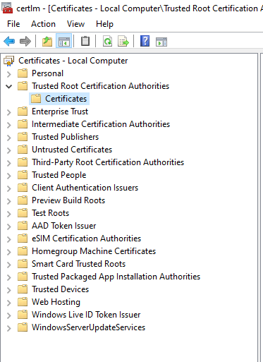

# Windows Installation

## Requirements

1. Windows 10 version 2004 and higher (Build 19041 and higher) or Windows 11.
2. Windows Subsystem for Linux (version 2).
3. Docker Desktop for Windows.
4. Windows Terminal (A Windows Store application).

## Installation Instructions

1. [Install Windows Subsystem for Linux (version 2) aka WSL](#install-windows-subsystem-for-linux-version-2-aka-wsl)
2. [Install Docker Desktop For Windows](#install-docker-desktop-for-windows)
3. [Install and configure SquareOne Global Docker in the VM](#install-and-configure-squareone-global-docker-in-the-vm)
4. [Install CA Certificate in Windows](#install-ca-certificate-in-windows)
5. [Configure Windows DNS / nameservers](#configure-windows-dns--nameservers)
6. [Complete launching the project](#complete-launching-the-project)

### Install Windows Subsystem for Linux (version 2) aka WSL

> **IMPORTANT:** you must have CPU virtualization enabled in your BIOS to use WSL. If you get an error after rebooting that WSL can't be started, follow these [Red Hat Instructions](https://access.redhat.com/documentation/en-us/red_hat_enterprise_linux/6/html/virtualization_administration_guide/sect-virtualization-troubleshooting-enabling_intel_vt_and_amd_v_virtualization_hardware_extensions_in_bios).

1. Install Windows Terminal from the [Windows App Store](https://www.microsoft.com/en-us/p/windows-terminal/9n0dx20hk701?activetab=pivot:overviewtab).
2. Launch Windows Terminal as an administrator (search for terminal, right click and **run as administrator**).
3. Disable any built in Windows HTTP instances: `net stop http`.
4. Install WSL: `wsl --install` to install the default Ubuntu VM (Virtual Machine) and reboot once asked to.

### Install Docker Desktop For Windows

1. Download the [installer](https://hub.docker.com/editions/community/docker-ce-desktop-windows) and follow the instructions.
2. Launch Docker Desktop, it should automatically configure itself for WSL support once terms are agreed to etc...

### Install and configure SquareOne Global Docker in the VM

> **NOTE:** We're going to use the "projects" folder in your Linux user's home directory to store your Tribe projects, aka `~/projects`.

We're going to configure the Ubuntu VM with the proper packages and install the `so` CLI tool for managing Tribe local environments.

1. Launch Windows Terminal.
2. Run `wsl` to start the VM and create your username and password when asked.
3. Copy the installation command from the main [README](../README.md#installation) and paste it into the terminal window.
4. Once the installation complete, open a new Windows Terminal tab and restart the VM by running: `wsl --shutdown` and then `wsl` to start it back up again.
5. Once back inside the VM shell, run the following to create a projects folder in your home directory and clone the SquareOne framework: `mkdir ~/projects; cd ~/projects; git clone https://github.com/moderntribe/square-one/ && cd square-one`
6. Start the project to download docker containers and generate SSL certificates: `so start`. Watch carefully for any errors, if everything goes smoothly, continue to the next section.

### Install CA Certificate in Windows

We've now automatically generated a CA certificate, but Windows doesn't know to trust it yet.

1. In your Windows taskbar, search for **certificates** and click on **Manage Computer Certificates** from the results.
2. From the left menu, expand **Trusted Root Certificate Authorities > Certificates**. 
3. 
4. From the top menu, select **Action > Import** and once you're asked to browse for a file, enter `\\wsl$\Ubuntu` into the Explorer bar and then navigate to `home/<your picked username>/.config/squareone/global/certs/` inside the VM. Change the dropdown to "All Files", and select the `tribeCA.pem` file. When asked, make sure the certificate is placed in the **Trusted Root Certificate Authorities Store**.
5. Fully restart all instances of your web browser.

### Configure Windows DNS / nameservers

You now have custom nameservers running inside the WSL VM, and you can use these to not have to adjust your hosts file manually.

#### GUI
1. Bring up your network adapter's properties, and select **Internet Protocol Version 4 (TCP/IPv4) properties**
2. Enter `127.0.0.1` as the preferred server, and any valid nameserver as the alternate. For example, `1.1.1.1` is Cloudflare and `8.8.8.8` is Google.

#### Or... set nameservers using the command line

1. Open Windows Terminal as an administrator. 
2. Run: `netsh interface show interface` and note the **Interface Name** of the adapter that is connected, something like "Ethernet", "Local Area Network" or your Wi-Fi adapter's name.
3. Run the following, but replace with the proper interface name: `netsh interface ipv4 add dnsservers "<Interface Name Here>" address=127.0.0.1 index=1`
4. Again, replace the proper interface and run: `netsh interface ipv4 add dnsservers "<Interface Name Here>" address=1.1.1.1 index=2`

### Complete launching the project

> **TIP:** You can find your files by opening Windows Explorer and placing `\\wsl$\Ubuntu` in the address bar. Navigate to `home/<your picked username>` and you can mount that folder as a Windows drive and open it in your preferred IDE to begin coding.

1. Return to your WSL VM, by opening a Windows Terminal window and typing `wsl`.
2. Return to the project we originally created: `cd ~/projects/square-one`.
3. Bootstrap the project to create your project's databases, WordPress user and build the frontend: `so bootstrap` and follow the onscreen instructions.
4. The project should automatically launch in your browser at `https://square1.tribe`. 
5. Review the [CLI usage instructions](https://github.com/moderntribe/square1-global-docker/#usage) and have fun!
